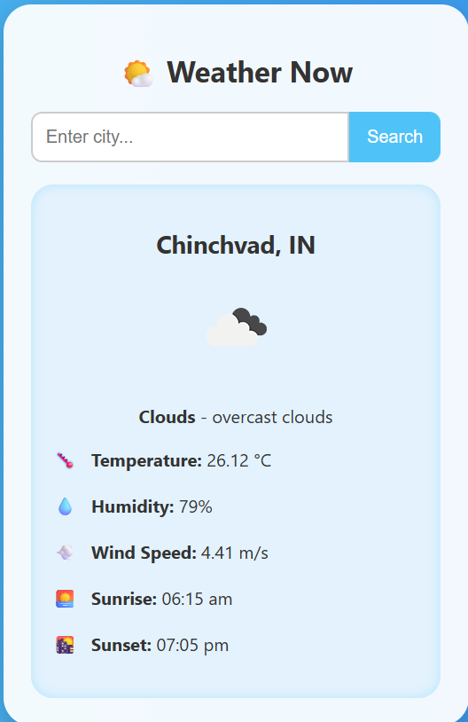
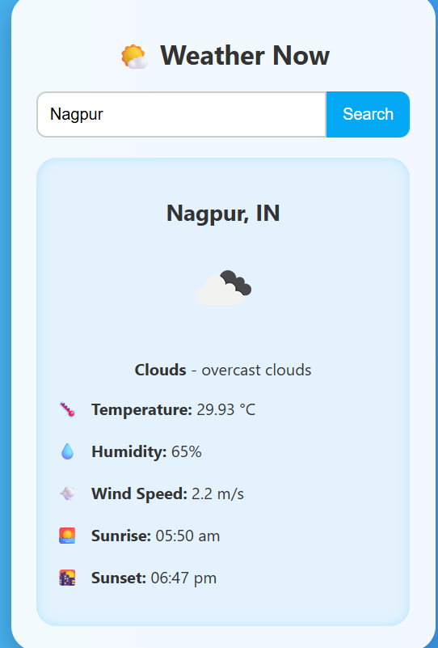

🌦️ Weather Now
A simple and elegant weather application that provides real-time weather updates for any city in the world.

🚀 Features:
📍 Detect current location automatically
🌍 Search weather by city name
☁️ Displays cloud status
🌡️ Current temperature in Celsius
💧 Humidity percentage
🌬️ Wind speed (m/s)
🌅 Sunrise & 🌇 Sunset timings
📱 Clean and responsive UI

🖼️ Screenshots:

📍 Chinchvad, IN:
  

📍 Nagpur, IN:

🛠️ Tech Stack:
Frontend: HTML, CSS, JavaScript
API: OpenWeatherMap API
Icons: Emojis & Font Awesome

⚙️ Installation:
Clone the repository:
git clone https://github.com/your-username/weather-now.git
cd weather-now

Open index.html in your browser.
(Optional) Add your own OpenWeather API key inside your script:
const apiKey = "YOUR_API_KEY";

🎯 How It Works:
Enter any city name in the search box.
Click Search.
Get instant weather details including temperature, humidity, wind speed, and sunrise/sunset times.

📌 Future Enhancements:
🌐 Add support for multiple languages
📊 5-day weather forecast

